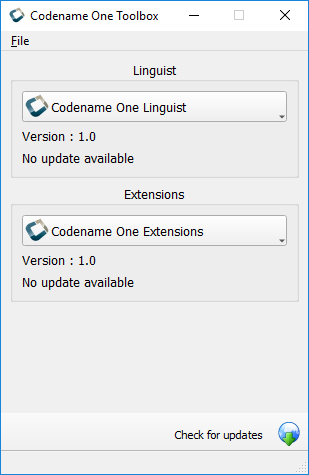
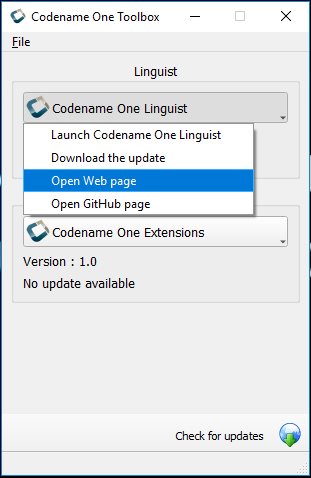
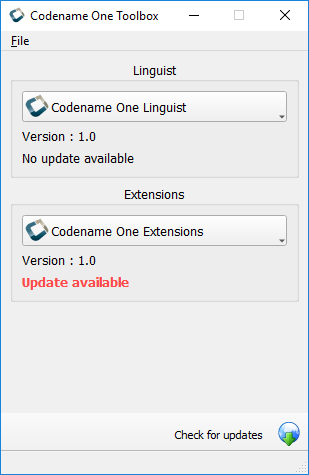

# Codename One Toolbox

### Overview :
Codename One Toolbox is a small application that you can use to manage different tools built for Codename One developers. Currently, you can use it to launch and to update CodenameOne Linguist and CodenameOne Extensions.

PS: You don't have to download Toolbox to be able to use these two tools. You can download them separately if you want.
- CodenameOne Linguist - https://ericlight.github.io/CN1Linguist
- CodenameOne Extensions - https://ericlight.github.io/CN1Extensions
- More tools will come later

### Features :
- Launch a tool (CN1 Linguist and CN1 Extensions)
- Update a tool (CN1 Linguist and CN1 Extensions)
- Get quick access to the homepage and GitHub page of the tool

### Roadmap :
- **Automatic update for tools**
- **News about tools**
- **Install new tools**
- **Downgrade to a previous version of any tool**
- Build for Mac OS
- Build for Linux
- Dark theme for the user interface
- Translate the app in others languages - I need help for that because i can only speak french and english

### Requirements :
- Windows PC - I'am a Windows user so this [first release](LIEN ICI) of Codename One Toolbox is built for Windows. The source code is completely portable and cross-platform (written in C++/Qt with a little part in Go) so if you are a Mac OS or Linux user, please clone the source code on GitHub and contribute by building it for Mac OS and Linux users. I can help you with some instructions to do it if you want. Check the Contributions section for more informations. Thanks :)

### Screenshots :

### Author :
My name is Eric, i use Codename One to develop mobile apps since the beginning and i'am also the author of the first book (written in french) on Codename One. I still to believe this framework deserves more visibility and users so i decide to build complete and easy-to-use tools to simplify the life of Codename One developers. 
 To send me a message, please use [codeureric@gmail.com](mailto:codeureric@gmail.com)

### Contributions :
You can suggest a feature here on GitHub. Just open an RFE and explain your feature idea. You can also open an issue if you find a bug or contribute to the translation of this tool in your language.

Need help to build the Mac OS and Linux versions. The source code is portable and is ready to be built. If you are interested to help in this way, please read the following instructions:

To compile the source code, you will need to download the QtCreator IDE which already contains the Qt framework. Choose the Mac OS or Linux version and help with a build for this platform. Here are the links for the download:
- http://download.qt.io/archive/qt/5.14/5.14.2/ (recommended to get the 5.14 offline installer version)
- https://www.qt.io/offline-installers

Once QtCreator installed in your computer, clone the source code of the project and open the ".pro" file to open the project and to compile. If you want me to send me a message, you can do it on [codeureric@gmail.com](mailto:codeureric@gmail.com). Thanks